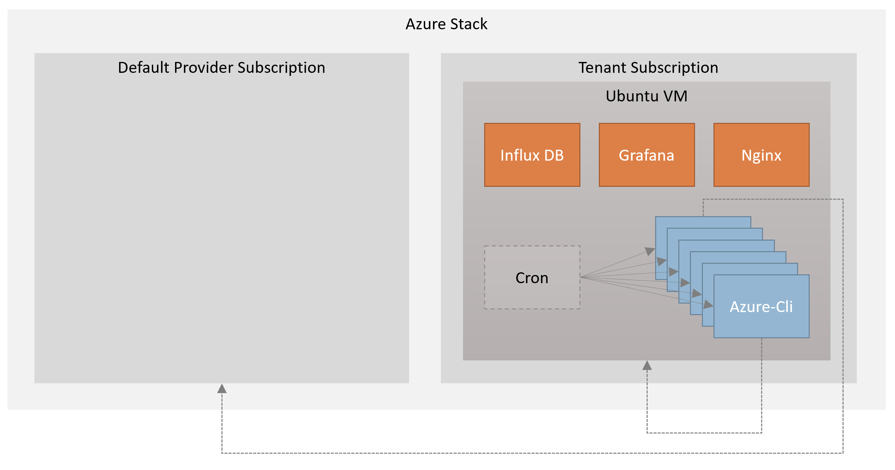

# AzureStack Uptime Monitor

Azure Stack Uptime Monitor is an open source based solution that tests the availability of Azure Stack endpoints and workloads. The solution will start testing Azure Stack endpoints directly after it is deployed. 

The solution runs on a single VM deployed to an Azure Stack tenant subscription. Multiple scripts are executed at various intervals with cron to test endpoints and workload availability. Each script is executed in a docker container with Azure CLI installed. The scripts write their output to an Influx time series database. The data in the database in visualized with Grafana. Influx and Grafana are both running in a docker container as well.
The data from the Influx database is exported to CSV containing the data from the previous week. The CSV is exported daily and stored in the export storage account.

The solution only runs open source software and does not require any licenses. The solution is available in two versions:

- Connected version
- Disconnected version

## Connected version
New updates (e.g. new tests and dashboards) are added to the solution based on feedback. The connected version can be updated with new features.
The connected version requires a activation key. The activation key can be acquired by submitting a [request](https://github.com/Azure/azurestack-uptime-monitor/issues/new?assignees=&labels=&template=request-activation-key.md&title=Please+provide+me+with+an+activation+key) on this repository.

[Deployment of the connected version](/docs/Connected.md)

## Disconnected version
The disconnected version can not be updated. Once installed, it will have to be fully redeployed to use a newer version, deleting all hisotrical data.

[Deployment of the disconnected version](/docs/Disconnected.md)

## Access

Once the deployment is complete the solution provides the following endpoints

- **Grafana portal** on **https://[loadbalancer-public-ip-address]:3000**
- **SSH to the VM** with **ssh [adminUserName]@[loadbalancer-public-ip-address]**

Each endpoint requires authentication. The Grafana portal can be accessed with username **admin** and the password specified for the **grafanaPassword** parameter. Connecting with SSH to the VM requires the the client to have the private key of the SSH key pair (matching the public key specified for the sshPublicKey parameter during deployment) imported into the terminal client.
